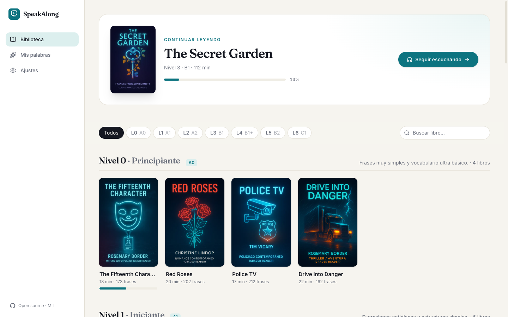

<p align="center">
  
</p>

<h1 align="center">SpeakAlong</h1>

<p align="center">
  Learn English by listening, reading and repeating out loud with graded audiobooks.<br/>
  <b>Free · Open source · No account · Runs on your computer</b>
</p>

<p align="center">
  <a href="https://github.com/r4yg/speakalong/releases/latest">Download</a> ·
  <a href="https://speakalong.app">speakalong.app</a> ·
  <a href="#español">Español</a>
</p>

<p align="center">
  
</p>

SpeakAlong started as a paid web service. We decided to release it for free: no sign-up, no subscription,
no tracking. Your progress and saved words stay on your own computer.

## Features

- **49 graded audiobooks** across 7 levels (A0 → C1), from short starter stories to full classics.
- **Line-by-line listening** with the English text and its Spanish translation.
- **Practice modes:** auto-advance, hear every line twice, and *pause to repeat* — a silence after each line
  so you can shadow it out loud.
- **Translation shown, hidden or tap-to-reveal**, and playback speed from 0.75× to 1.25×.
- **Save words** by tapping them, add a note, look them up in a dictionary and export your list to CSV or PDF.
- **Local-first:** everything is stored on the device. Export/import a backup file to move to another computer.
- Light and dark themes, Spanish and English interface, keyboard shortcuts (Space, ←, →).

## Download

Get the installer for your system from the [latest release](https://github.com/r4yg/speakalong/releases/latest):

| System | File |
| --- | --- |
| macOS (Apple Silicon) | `SpeakAlong-mac-arm64.dmg` |
| macOS (Intel) | `SpeakAlong-mac-x64.dmg` |
| Windows | `SpeakAlong-windows-x64-setup.exe` (or `arm64`) |
| Linux | `SpeakAlong-linux-x86_64.AppImage` or `.deb` (also `arm64`) |

The installers are not signed with a paid developer certificate, so your system may warn you the first time:

- **macOS:** open the `.dmg`, drag SpeakAlong to Applications, then right-click the app → **Open**.
  On macOS 15+, if it is blocked, go to *System Settings → Privacy & Security* and click **Open Anyway**,
  or run `xattr -cr /Applications/SpeakAlong.app` in Terminal.
- **Windows:** if SmartScreen appears, click **More info → Run anyway**.
- **Linux:** `chmod +x SpeakAlong-*.AppImage` and run it, or install the `.deb` with `sudo apt install ./SpeakAlong-*.deb`.

An internet connection is needed while listening: the audio of each line is streamed.

## Run from source

Requires Node.js 22+.

```bash
git clone https://github.com/r4yg/speakalong.git
cd speakalong
npm install
npm run dev            # web version at http://localhost:5173
npm run electron:dev   # desktop app
npm run dist           # build installers for the current OS into release/
```

The web build (`npm run build` → `dist/`) is fully static and can be hosted on any web server or opened
from any sub-path.

## How it works

```
public/content/catalog.json      levels and books
public/content/books/<id>.json   lines of each book: { n, en, es, d }
public/covers/*.webp             book covers
src/                             React app (Vite + Tailwind)
electron/main.cjs                desktop shell
```

Audio is loaded from `<VITE_MEDIA_BASE_URL>/audio/<book path>/<line number>.mp3`
(see `.env.example`). To host your own copy of the audio, mirror that layout and set the variable at build time.

`scripts/export_content.py` regenerates the JSON content from the original PostgreSQL database. It reads only the
book tables.

Releases are built by GitHub Actions: push a tag such as `v1.0.1` and the
[release workflow](.github/workflows/release.yml) builds the macOS, Windows and Linux installers and attaches them
to a GitHub Release.

## Contributing

Issues and pull requests are welcome — bug fixes, new interface languages, accessibility improvements or new books.

## License

The source code is released under the [MIT License](LICENSE). Book texts, translations, audio and covers are
distributed for educational, non-commercial use; see [CONTENT.md](CONTENT.md).

---

## Español

SpeakAlong nació como un servicio de pago para aprender inglés con audiolibros graduados. **Hemos decidido
liberarlo**: ahora es gratis, de código abierto y no necesita cuenta. Tu progreso y tus palabras se guardan solo
en tu ordenador.

**Descarga** el instalador para tu sistema desde la [última versión](https://github.com/r4yg/speakalong/releases/latest)
(macOS, Windows y Linux). Como los instaladores no están firmados con un certificado de pago, la primera vez:

- **macOS:** clic derecho sobre la app → **Abrir** (o *Ajustes del Sistema → Privacidad y seguridad → Abrir igualmente*).
- **Windows:** en SmartScreen, **Más información → Ejecutar de todas formas**.

Necesitas conexión a internet mientras escuchas, porque el audio de cada frase se descarga al reproducirla.

<p align="center">
  
</p>
